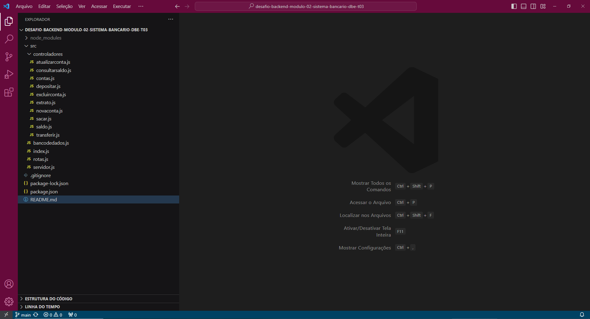

# API de Banco Digital

Esta é uma API REST que permite gerenciar contas bancárias e realizar operações financeiras básicas.

## Recursos Disponíveis

A API oferece os seguintes recursos:

- Listagem de contas bancárias
- Criação de conta bancária
- Atualização dos dados do usuário da conta bancária
- Exclusão de uma conta bancária
- Depósito em uma conta bancária
- Saque de uma conta bancária
- Transferência de valores entre contas bancárias
- Consulta de saldo da conta bancária
- Emissão de extrato bancário

## Representação de Valores

Todos os valores (dinheiro) são representados em centavos. Por exemplo, R$ 10,00 reais são representados como 1000 centavos.

## Estrutura do Projeto

O projeto está organizado da seguinte forma:

- `index.js`: O arquivo de entrada principal.
- `server.js`: O arquivo que inicia o servidor Express.
- `routes/`: Este diretório contém os arquivos de rota.
- `controllers/`: Aqui, você encontrará os controladores que definem o comportamento das rotas.
- `models/`: Contém os modelos de dados do aplicativo.
- `utils/`: Pasta para utilitários e funções auxiliares.

## Configuração

Você pode configurar as informações do banco de dados, como host, porta, nome do banco de dados, etc., no arquivo `config.js`.

## Uso da API

Aqui estão exemplos de como usar a API:

- **Listagem de Contas Bancárias:**
  - `GET /contas`

- **Criação de Conta Bancária:**
  - `POST /contas`

- **Atualização dos Dados do Usuário:**
  - `PUT /contas/:id`

- **Exclusão de Conta Bancária:**
  - `DELETE /contas/:id`

- **Depósito em Conta Bancária:**
  - `POST /contas/:id/depositar`

- **Saque de Conta Bancária:**
  - `POST /contas/:id/sacar`

- **Transferência entre Contas Bancárias:**
  - `POST /contas/:origem/transferir/:destino`

- **Consulta de Saldo da Conta Bancária:**
  - `GET /contas/:id/saldo`

- **Emissão de Extrato Bancário:**
  - `GET /contas/:id/extrato`

Lembre-se de que você precisará autenticar as solicitações e incluir cabeçalhos apropriados para proteger a API.

## Contribuição

Sinta-se à vontade para contribuir com melhorias, correções de bugs ou novos recursos para este projeto. Basta criar um fork, fazer suas alterações e enviar uma solicitação pull.

## Licença

Este projeto é licenciado sob a Licença MIT. Consulte o arquivo `LICENSE` para obter mais informações.

---

Desfrute de usar a API do banco digital! Se você tiver alguma dúvida ou precisar de ajuda, não hesite em entrar em contato.
